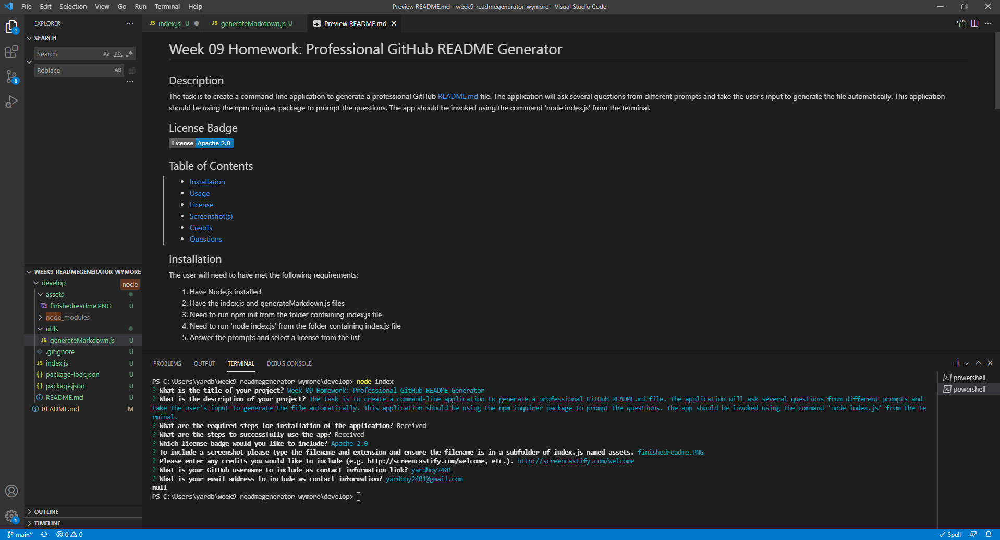

  # Professional GitHub README Generator-Wymore
  
  ## Description
  The task is to create a command-line application to generate a professional GitHub README file. The application will ask several questions from a prompt and take the user's input to generate the file automatically. This app should be using the npm inquirer package to prompt the questions. The app should be invoked using the command 'node index.js' from the terminal.

  ## License Badge
  
  
  ## Table of Contents
  - [Installation](#installation)
  - [Usage](#usage)
  - [License](#license)
  - [Screenshot(s)](#screenshot)
  - [Credits](#credits)
  - [Questions](#questions)
  
  ## Installation
  1. Need to have node.js installed
2. Need to have index.js and generateMarkdown.js files present
3. Run command 'npm init' in terminal from the folder with index.js file
4. Run command 'npm install inquirer' from the folder with index.js file
5. Run command 'node index.js' from the folder containing index.js file

  ## Usage
  1. In VSCode right-click the folder in explorer and 'Open in Integrated Terminal'
2. Run 'node index.js' from the folder contatining index.js file
3. Answer prompts and for text editor steps simply save on exit to update
4. Check out the generated README file in folder containing index.js file

  
  ## License
  This application is licensed under the MIT License. A short and simple permissive license with conditions only requiring preservation of copyright and license notices. Licensed works, modifications, and larger works may be distributed under different terms and without source code.

  https://opensource.org/licenses/MIT
  
  ## Screenshot(s)
  
   

  ## Credits
  http://screencastify.com/welcome

  ## Questions
  www.github.com/yardboy2401

  mailto:yardboy2401@gmail.com

  ## Link to Walkthrough Video
  https://drive.google.com/file/d/1uSthaUMj6V4z1nWiMSs2_JEvfpXid5fj/view?usp=sharing
  - - - -
  
