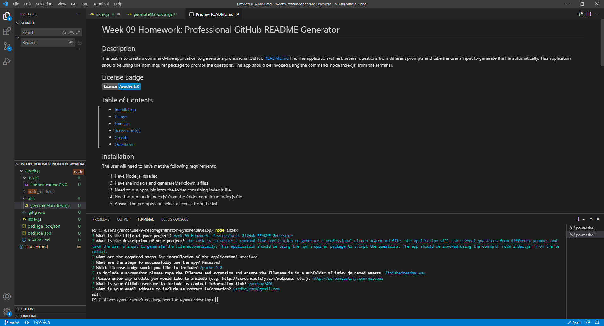

  # Week 09 Homework: Professional GitHub README Generator
  
  ## Description
  This is where the description of project will go.

  ## License Badge
  
  
  ## Table of Contents
  - [Installation](#installation)
  - [Usage](#usage)
  - [License](#license)
  - [Screenshot(s)](#screenshot)
  - [Credits](#credits)
  - [Questions](#questions)
  
  ## Installation
  What is required for installation?

1. Need to have node.js installed
2. Need to have index.js file present
3. ...

  ## Usage
  What are the steps to successfully use the application?

1. In VSCode...
  
  ## License
  This application is licensed under the MIT License. A short and simple permissive license with conditions only requiring preservation of copyright and license notices. Licensed works, modifications, and larger works may be distributed under different terms and without source code.

  https://opensource.org/licenses/MIT
  
  ## Screenshot(s)
  
   

  ## Credits
  http://screencastify.com/welcome

  ## Questions
  www.github.com/yardboy2401

  mailto:yardboy2401@gmail.com

  - - - -
  